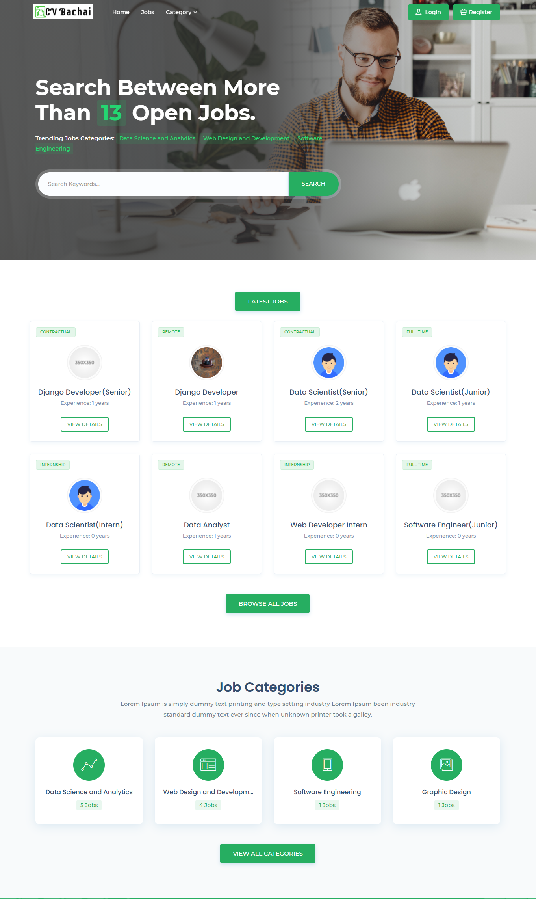

# <p align="center">CV Recommender</p>

A web based automated CV Recommended system where Recruiter can Post and Manage jobs and Applicant can apply for their desired jobs and manage their profile. The
proposed system is designed to save time while shortlisting resumes in a fair
and efficient way. Recruitment can be a headache when it comes to screening
the resumes and shortlist them from a large stockpile of CVs however there
is no other way of selecting candidates without screening as the future of the
company depends on what type of employees it hires. The proposed system
allows both job seekers and recruiters to use it with ease. The system enables
the job hunters to apply for a job post by providing their necessary information
in our pre defined template resumes. There is also provision for job seekers
to upload their electronic CVs as well so that the recruiter might look at it if
required. The recruiters on the other hand, can use the system to post about
jobs and get a ranked list sorted in order of most decorated to less decorated
CVs. The ranking is done by using an equation that attaches weights to the
information given by applicants on the template resume. The ranking will be
visible to the recruiter and they will be able to filter out the results based on
separate attributes as well as an overall ranking. After the ranking process the
recruiter can send email alerts automatically to the applicants with single click
if they wish.

<p align="center"> </p>

# Getting Started

These instructions will get you a copy of the project up and running on your local machine for development and testing purposes. See deployment notes on how to deploy the project on a live system.

## Get this Repo on your local machine

To use or work on this project you need to **Download** or **Clone** this repository.

### To Download :

-   Just click on **Code**

-   click **Download Zip**

### To Clone :

```sh
git clone https://github.com/hhhameem/CV-Recommender.git
```

## Make your development environment ready

Now, as you have successfully downloaded this repository you need to make your development environment ready to see this project on the development server. Just follow the instructions below:

-   Go to the CV-Recommender folder
-   Activate the Virtual Environment
    ```sh
    Scripts\activate.bat
    ```
-   Install the requirements
    ```py
    pip install -r requirements.txt
    ```
-   Go to the project folder
    ```sh
    cd cv_recommender
    ```
-   Activate the runserver
    ```py
    py manage.py runserver
    ```
    and now you can see this live on **localhost**.

## Deployment

To deploy this project free on [pythonanywhere](https://www.pythonanywhere.com/) please follow [This official Document](https://help.pythonanywhere.com/pages/DeployExistingDjangoProject/) or [This Tutorial](https://www.youtube.com/watch?v=Y4c4ickks2A).

# Usage

As you have successfully made the development environment ready you can now test & use this web app under the development server. Just register with your **Email & Password** and explore the website.

# Built With

-   [HTML](https://en.wikipedia.org/wiki/HTML) - Markup Language
-   [CSS](https://en.wikipedia.org/wiki/CSS) - For Styling the markup
-   [Javascript](https://www.javascript.com/) - For adding Interactivity
-   [Django](https://www.djangoproject.com/) - For Backend
-   [SQLite](https://www.sqlite.org/index.html) - For Database
-   [Python](https://www.python.org/) - For Scripting

# Team Members

-   [Mehjabin Johra](https://github.com/mjohra)
-   [Mohammad Farhan](https://github.com/farhanm9)
-   Md. Al Moktadir Chowdhury
-   Mostahid Ahmed
-   A. M. Kabbo Hossain

# Contributing

Contributions are what make the open source community such an amazing place to be learn, inspire, and create. Any contributions you make are greatly appreciated.

1. Fork the Project

2. Create your Feature Branch (git checkout -b feature/AmazingFeature)

3. Commit your Changes (git commit -m 'Add some AmazingFeature')

4. Push to the Branch (git push origin feature/AmazingFeature)

5. Open a Pull Request

# License

This project is licensed under the MIT License - see the [LICENSE.md](LICENSE.md) file for details

# Acknowledgements

-   [Template](https://themeforest.net/item/jobhit-job-portal-html-template/29922683)
-   [Dennis Ivy](https://www.youtube.com/channel/UCTZRcDjjkVajGL6wd76UnGg)
-   [Samuli Natri](https://www.youtube.com/channel/UC_F-PRC-SXbaGj_kmMZSotA)
-   [PurpleBooth](https://gist.github.com/PurpleBooth/109311bb0361f32d87a2)
-   [othneildrew](https://github.com/othneildrew/Best-README-Template/blob/master/README.md)
-   and a lot of unknown resources
